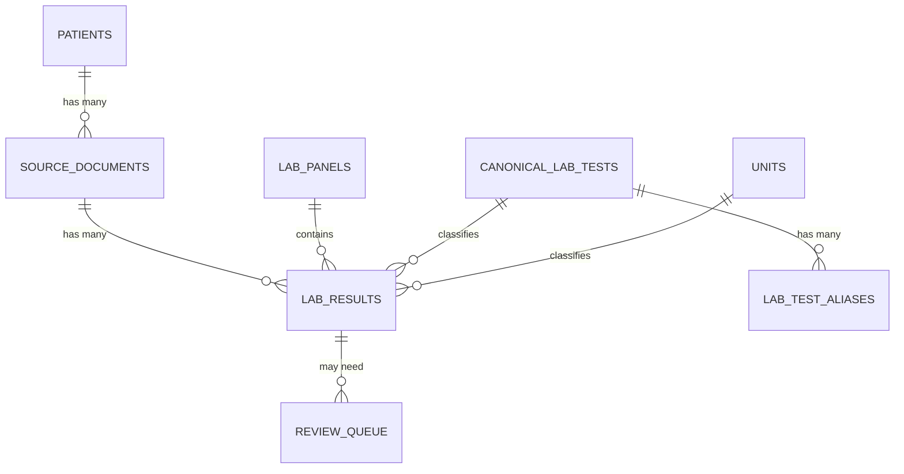

# LabLens

[](https://github.com/nicolerollo/lablens/actions/workflows/ci.yml)

> LabLens transforms messy extracted clinical lab text from fragmented healthcare PDF exports into normalized longitudinal lab records, database-backed analytics, and physician-friendly summaries.

> This repository uses synthetic demo data only. It is not a medical device, does not diagnose anything, and does not provide medical advice.

## The problem

Healthcare lab records are fragmented across systems: a military health system, an academic
medical center, a regional hospital. Each one exporting a patient's labs as its own PDF,
formatted for a human to skim, not for software to analyze. The same patient's potassium history
might live in three different PDFs across three different layouts, with no shared structure tying
them together.

LabLens is a clinical PDF extraction, normalization, database, and physician-reporting pipeline that demonstrates how to take *already-extracted* text from multiple source systems and turn it into one clean, queryable, trendable patient record.

## 📊 The database layer, up front

The relational database is the core of this project. Full documentation:
**ERD, data dictionary, normalization rationale, provenance model, and example queries run against
real generated output** Lives in **[`docs/database.md`](docs/database.md)**. 



(This is the abridged view. The full ERD with every table and column is in:
[`docs/database.md`](docs/database.md).)

## What LabLens does and does not do

LabLens picks up **after** PDF text/table extraction, not before:

- ✅ Auto-detects which of three source-system formats a text export is, and parses it accordingly
- ✅ Tolerates messy real-world extraction artifacts: line-wrapped rows, repeated letterhead,
  page-break footers, and panels that continue under a repeated header
- ✅ Preserves the raw extracted value, unit, and reference range alongside every normalized field
- ✅ Resolves raw test names to canonical concepts **entirely from the `lab_test_aliases` table**.
  There is no Python alias dictionary; adding a mapping is one `INSERT`, not a code change,
  and prefers a source-specific alias over a generic one when both exist for the same raw name
- ✅ Normalizes common CBC unit variants (`10^3/uL`, `x10^6/uL`, `M/µL`, case differences, ...)
  instead of flagging every spelling as ambiguous
- ✅ Tracks full provenance — patient → source document → extraction run → panel → result (on every row)
- ✅ Flags unmapped tests, low-confidence rows, and **cross-source duplicate results** into a human
  review queue (exportable to CSV) instead of silently trusting or dropping them
- ✅ Computes personal-baseline analytics (median, IQR, trend, z-score) across *all* source systems combined
- ✅ Generates a physician-friendly longitudinal summary, flagged for review priority (not diagnosis)
- ✅ Ships a small CLI (`lablens parse|ingest|report|export-review|demo`), not just one demo script
- ❌ Does **not** implement OCR or PDF parsing itself; assumes tools like `pdfplumber`, `PyMuPDF`,
  Camelot, or Tabula already did that upstream
- ❌ Is **not** a diagnostic tool, clinical decision support system, or medical device
- ❌ Never touches real patient data. Every sample input is synthetic and de-identified by design

## Pipeline

```text
 PDF exports from multiple systems
 (military-health-style, academic-medical-center-style, regional-hospital-style, ...)
        │
        ▼
 upstream PDF text/table extraction        ← not built here; pdfplumber/PyMuPDF/Camelot/Tabula
        │
        ▼
 source format auto-detection + parsing    ← sources.py registry → parser.py / academic_medical_center_parser.py / regional_hospital_parser.py
        │
        ▼
 raw result preservation                   ← raw value / unit / reference range kept verbatim
        │
        ▼
 test-name and unit normalization          ← normalizer.py: aliasing, numeric & qualitative handling
        │
        ▼
 relational database storage               ← database.py + sql/schema.sql: provenance, dedup, review queue
        │
        ▼
 personal baseline analytics               ← analytics.py: median, IQR, trend, z-score
        │
        ▼
 physician-friendly report                 ← report.py: Markdown + HTML, review-priority triage
```

Each stage is documented in its own doc:

- [`docs/phase1_parsing.md`](docs/phase1_parsing.md) — why there's one parser per source format,
  how the registry pattern lets a new source system plug in without touching anything else, and
  how format auto-detection works
- **[`docs/database.md`](docs/database.md)** — ERD, full data dictionary, normalization rationale,
  provenance model, and example queries with real output
- [`docs/phase2_database.md`](docs/phase2_database.md) — narrative walkthrough of the schema and
  the multi-source merge design
- [`docs/phase3_physician_reports.md`](docs/phase3_physician_reports.md) — what the report shows,
  the review-priority logic, and why the language is deliberately descriptive, not diagnostic

## Worked example: the same patient, three health systems

The bundled demo ingests synthetic lab data for one patient as if it came from **three different
health systems**, each with its own export layout, and auto-detects which is which:

```text
data/sample_input/synthetic_lab_summary.txt              military-health-style, pipe-delimited rows
data/sample_input/academic_medical_center_style_lab_summary.txt            academic-medical-center-style, dot-leader rows
data/sample_input/regional_hospital_style_lab_summary.txt   regional-hospital-style, key=value rows
```

All three feed the same normalization → database → analytics → report pipeline. The result: a
single Potassium trend spanning a military-health-style draw in January, an academic-medical-center-style draw in
February, and a regional-hospital-style draw in May, All merged into one continuous, reviewable
history instead of three disconnected PDFs a clinician would have to compare by eye. The sample
data also includes a deliberately duplicated Sodium result reported by two different systems for
the same date, which the database flags as `possible_duplicate` and excludes from baseline math
rather than double-counting (see [`docs/database.md`](docs/database.md#example-queries-with-real-output)).

## Example normalized record

```json
{
  "panel": "CBC WITH DIFFERENTIAL",
  "collection_date": "2026-01-14",
  "test_name_raw": "WBC",
  "value_raw": "7.2",
  "numeric_value": 7.2,
  "unit_raw": "K/uL",
  "ref_range_raw": "4.0 - 11.0 K/uL",
  "ref_low": 4.0,
  "ref_high": 11.0,
  "interpretation": "normal",
  "canonical_test_name": "White blood cell count"
}
```

`canonical_test_name` starts out `null` straight out of the parser/normalizer. It's filled in
only once `insert_results()` resolves it against `lab_test_aliases` in the database (see
[`docs/database.md`](docs/database.md#alias-mapping-is-database-driven)). The JSON above reflects
a result *after* that DB round-trip, which is what `lablens-demo` writes.

## Quick start

```bash
python -m venv .venv
source .venv/bin/activate  # Windows: .venv\Scripts\activate
pip install -e ".[dev]"
pytest
```

Run the demo pipeline. This auto-detects and parses **all three** synthetic source files, stores
everything in one patient record, and writes the reports:

```bash
lablens-demo
```

```text
Detected military_health_style and parsed 32 results from military_health_style_demo (synthetic_lab_summary.txt)
Detected academic_medical_center_style and parsed 10 results from academic_medical_center_style_demo (academic_medical_center_style_lab_summary.txt)
Detected regional_hospital_style and parsed 8 results from regional_hospital_style_demo (regional_hospital_style_lab_summary.txt)
Parsed 50 synthetic lab results from 3 source systems
5 rows flagged for human review
Wrote data/sample_output/normalized_results.json
Wrote data/sample_output/lablens_demo.sqlite
Wrote data/sample_output/physician_summary.md
Wrote data/sample_output/physician_summary.html
Wrote data/sample_output/review_queue.csv
```

(Down from 13 review-queue rows to 5 after the unit-normalization improvements below. The
remaining 5 are genuinely unmapped tests and one real cross-source duplicate, not unit-spelling noise.)

Open `data/sample_output/physician_summary.html` in a browser, browse
`data/sample_output/review_queue.csv` for the rows flagged for human review, or query the SQLite
file directly with [`sql/example_queries.sql`](sql/example_queries.sql).

> **Note on `data/sample_output/`:** `physician_summary.md`, `physician_summary.html`,
> `normalized_results.json`, and `review_queue.csv` are committed as worked examples you can read
> on GitHub without running anything. `lablens_demo.sqlite` is **not** committed (`*.sqlite` is
> gitignored). It's a regenerable binary artifact; run `lablens-demo` or `lablens ingest` to
> produce it locally.

## CLI

Beyond the bundled `lablens-demo` script, LabLens ships a small `argparse` CLI for working with
one file or database at a time:

```bash
# Parse one file, auto-detecting its source format, and print normalized JSON (no DB write)
lablens parse data/sample_input/academic_medical_center_style_lab_summary.txt

# Parse and store one file -- or every .txt file in a directory -- into a SQLite database
lablens ingest data/sample_input/ --db data/sample_output/lablens_demo.sqlite

# Generate physician-summary Markdown/HTML reports from an existing database
lablens report data/sample_output/lablens_demo.sqlite --out data/sample_output/

# Export the human review queue to CSV
lablens export-review data/sample_output/lablens_demo.sqlite

# Run the full three-source bundled demo (equivalent to `lablens-demo`)
lablens demo
```

`parse` and `ingest` auto-detect the source format per file by default; pass `--source-system` to
force a specific parser instead (useful for the [messy fixture](#a-messier-fixture) below, or any
input where auto-detection is ambiguous).

## A messier fixture

`data/sample_input/messy_academic_medical_center_extracted_text.txt` is deliberately uglier than the other three
sample files, to reflect what real PDF text extraction actually tends to produce: a row's value
and unit wrapped onto the next line because a column was too narrow, the same letterhead repeated
on every page, a `Performed At:` footer, a panel that continues under a second copy of its own
header after a page break, and one qualitative (non-numeric) result. `academic_medical_center_parser.py` recovers
from all of it. See [`docs/phase1_parsing.md`](docs/phase1_parsing.md#handling-messy-extraction-artifacts)
and `tests/test_messy_academic_medical_center_fixture.py`.

## Project structure

```text
lablens/
  src/lablens/
    parser.py                  # military-health-style parser: pipe-delimited rows
    academic_medical_center_parser.py            # academic-medical-center-style parser: dot-leader rows (+ wrap/junk recovery)
    regional_hospital_parser.py   # regional-hospital-style parser: key=value rows
    sources.py                  # Source registry + format auto-detection
    normalizer.py               # Raw-value normalization: numeric/qualitative, units, ref ranges
    database.py                 # Schema, alias resolution, unit resolution, dedup, review queue + CSV
    analytics.py                # Median, IQR, trend, z-score, review-priority logic
    report.py                   # Physician-friendly Markdown and HTML reports
    demo.py                     # End-to-end demo across all three synthetic source systems
    cli.py                      # argparse CLI: parse / ingest / report / export-review / demo
  data/sample_input/
    synthetic_lab_summary.txt                # military-health-style sample
    academic_medical_center_style_lab_summary.txt              # academic-medical-center-style sample
    regional_hospital_style_lab_summary.txt     # regional-hospital-style sample
    messy_academic_medical_center_extracted_text.txt           # Deliberately messy: wraps, junk lines, repeated headers
  data/sample_output/          # physician_summary.{md,html}, normalized_results.json, review_queue.csv
                                # committed as worked examples; lablens_demo.sqlite is gitignored
  docs/
    database.md            # ERD, data dictionary, normalization rationale, example queries
    phase1_parsing.md
    phase2_database.md
    phase3_physician_reports.md
    data_model.md
    roadmap.md
  sql/
    schema.sql              # SQLite schema (what the app actually runs)
    schema_postgres.sql      # PostgreSQL port (migration path, see docs/database.md)
    example_queries.sql
  docker-compose.yml         # Spins up Postgres with schema_postgres.sql applied
  tests/
```

## Database design

LabLens uses a normalized SQLite schema (`sql/schema.sql`) covering patients, source documents,
extraction runs, panels, canonical lab tests, aliases, units, results, and a human review queue;
not a single flat table. Key choices:

- raw values and normalized values are stored side by side, never one in place of the other
- lab-specific reference ranges are preserved per result, not replaced with a universal range
- **alias resolution is entirely database-driven**: `lab_test_aliases` is the only place `WBC`,
  `White Blood Cell Count`, and `Leukocytes` map to one canonical test. There is no parallel
  Python dictionary to keep in sync, and `database.resolve_canonical_test()` is the single
  function that does the lookup
- **unit resolution is case-insensitive** and the seeded `units` table covers realistic CBC
  variants (`10^3/uL`, `x10^6/uL`, `M/µL`, `K/mcL`, ...) so predictable spelling differences
  normalize cleanly instead of generating noisy review-queue rows
- every result carries its full provenance chain (patient → source document → extraction run →
  panel), so multiple PDFs can be merged into one patient history without losing where each value
  came from
- uncertain rows (unmapped tests, low confidence, abnormal qualitative findings, **and
  cross-source duplicate results**) are flagged in a review queue instead of silently trusted or
  dropped

**See [`docs/database.md`](docs/database.md) for the full ERD, data dictionary, normalization
rationale, and example queries with real output**. Narrative
companions: [`docs/phase2_database.md`](docs/phase2_database.md) and
[`docs/data_model.md`](docs/data_model.md).

## Project framing

This project is designed to show:

- relational database design: normalization, provenance modeling, alias mapping, reference-range
  modeling, and uncertainty/review-queue modeling
- biomedical data normalization across fragmented, heterogeneous source formats
- messy healthcare data handling without building OCR/PDF extraction from scratch
- ETL reasoning: source-specific parsing (with format auto-detection) feeding one normalized pipeline
- longitudinal analytics over multi-source relational data
- clinically readable, explicitly non-diagnostic output generation

## Safety and privacy

- Do not commit real medical records.
- Use synthetic, de-identified, or manually fabricated sample data.
- Keep raw PDF files out of the repository unless they are public demo files.
- This is an educational project, not a clinical decision support tool.

## Limitations

- LabLens assumes upstream PDF text/table extraction already happened; it does not parse PDFs or
  run OCR itself.
- Each source system needs its own small parser module. Adding a new system means writing a new
  parser and detector, not configuring an existing one.
- Format auto-detection (`sources.detect_source_system`) is a simple header-pattern match, not a
  robust classifier. Ambiguous or unrecognized input returns `None` rather than guessing.
- The academic-medical-center-style parser's line-wrap recovery is a one-line lookahead (merge with the very next
  line and retry the row pattern); it would not recover a row wrapped across three or more lines.
- The alias and canonical-test list is intentionally small and seeded for the synthetic demo only.
  Unrecognized tests are preserved verbatim and routed to the review queue rather than guessed at.
- Duplicate detection matches on exact (canonical test, date, value); a same-day redraw with a
  genuinely different value from a different source would not be flagged.
- Unit conversion is a simple multiplicative factor lookup; it does not handle non-linear
  conversions or lab-specific assay differences, and the seeded variants focus on CBC cell-count
  units specifically, not every unit family.
- Qualitative interpretation (`DETECTED` / `POSITIVE` / etc.) uses a fixed keyword list and marks
  unrecognized phrasing as `qualitative_indeterminate` rather than guessing.
- `sql/schema_postgres.sql` and `docker-compose.yml` prove the schema is portable, but
  `database.py` still talks to SQLite directly. See "PostgreSQL migration path" in
  [`docs/database.md`](docs/database.md).
- `lablens apply-review` (re-importing human corrections from a reviewed CSV back into the
  database) does not exist yet; `export-review` is one-directional today. See Future extensions.

## Future extensions

- Add `lablens apply-review <reviewed.csv>` to close the human-in-the-loop review workflow
  (export → human edits CSV → re-import corrections), building on the existing `export-review`
- Add `collected_at` / `received_at` / `resulted_at` timestamp fields alongside `collection_date`
  for source documents that report more than a bare date
- Wire `database.py` up to actually run against PostgreSQL (schema and docker-compose are ready;
  the Python connection layer is not yet dual-backend)
- Add a simple web UI for the review queue, beyond the current CSV export
- Strengthen duplicate detection to also consider panel and unit-after-normalization, not just
  (canonical test, date, value)
- Add unit conversion tables and lab-specific/literature reference intervals for non-CBC unit families
- Add interactive graphs and polished PDF report export
- Add FHIR Observation export for interoperability

## Tests

```bash
pytest
```

The suite (run `pytest -q` to see the current count) covers all three source parsers plus the
deliberately messy fourth fixture (line-wrap recovery, junk-line skipping, panel continuation,
format auto-detection), normalization (numeric, qualitative, and reference-range parsing), the
database layer (database-driven alias resolution including source-specific overrides, CBC
unit-variant normalization, multi-source inserts, cross-source duplicate detection, repeated-connect
idempotency, review queue, CSV export), the report layer (Markdown/HTML generation,
qualitative-result surfacing, low-observation-count wording), and the CLI
(`parse`/`ingest`/`report`/`export-review`).
