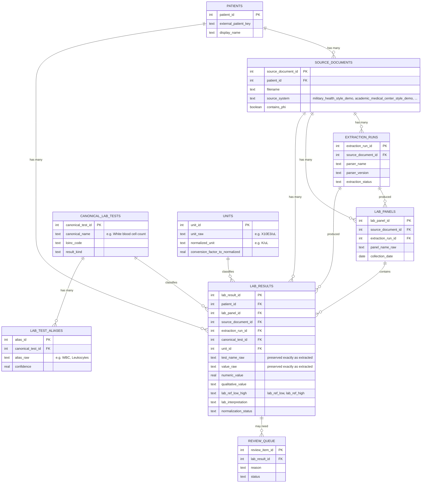

# Database design

This is the single source of truth for LabLens's relational database: the entity-relationship
diagram, a full column-by-column data dictionary, the normalization rationale, and a set of
example queries run against the actual generated demo database with real output. If you only
read one doc in this repository to evaluate the database layer, read this one.

The implemented schema lives in [`sql/schema.sql`](../sql/schema.sql) (SQLite) and
[`sql/schema_postgres.sql`](../sql/schema_postgres.sql) (PostgreSQL port). The code that writes to
it is [`src/lablens/database.py`](../src/lablens/database.py).

## Entity-relationship diagram



Read top to bottom: a **patient** has many **source documents** (one per PDF export, tagged with
which health system it came from); each source document has an **extraction run** (which parser,
which version) and contributes **lab panels** (one per "CBC drawn on this date" header) and **lab
results** (one row per test). Each result is optionally classified against a **canonical lab
test** (via the **alias** table) and a **unit**. Anything uncertain lands in the **review queue**.

## Data dictionary

### `patients`

| Column | Type | Notes |
|---|---|---|
| `patient_id` | INTEGER PK | |
| `external_patient_key` | TEXT, UNIQUE, NOT NULL | Synthetic identifier (`SYNTH-001` in the demo); this is the join point that lets results from multiple source systems resolve to one patient |
| `display_name` | TEXT, NOT NULL | |
| `created_at` | TEXT (ISO timestamp) | |

### `source_documents`

One row per extracted-text input file — the provenance anchor for "which health system did this
come from."

| Column | Type | Notes |
|---|---|---|
| `source_document_id` | INTEGER PK | |
| `patient_id` | INTEGER, FK → `patients` | |
| `filename` | TEXT, NOT NULL | e.g. `academic_medical_center_style_lab_summary.txt` |
| `document_type` | TEXT, default `extracted_pdf_text` | |
| `source_system` | TEXT | e.g. `military_health_style_demo`, `academic_medical_center_style_demo`, `regional_hospital_style_demo` |
| `document_date` | TEXT | Reserved for the PDF's own export/print date, if known |
| `contains_phi` | INTEGER (0/1) | Always `0` in this repo — synthetic data only |
| `notes` | TEXT | |
| `created_at` | TEXT (ISO timestamp) | |

### `extraction_runs`

One row per parser invocation against a source document.

| Column | Type | Notes |
|---|---|---|
| `extraction_run_id` | INTEGER PK | |
| `source_document_id` | INTEGER, FK → `source_documents` | |
| `parser_name` | TEXT, NOT NULL | e.g. `lablens_academic_medical_center_style_parser` |
| `parser_version` | TEXT, NOT NULL | |
| `extraction_started_at` | TEXT (ISO timestamp) | |
| `extraction_status` | TEXT, default `completed` | |
| `notes` | TEXT | |

### `canonical_lab_tests`

The controlled vocabulary of lab concepts LabLens knows about, independent of how any one source
spells a test's name.

| Column | Type | Notes |
|---|---|---|
| `canonical_test_id` | INTEGER PK | |
| `canonical_name` | TEXT, UNIQUE, NOT NULL | e.g. `White blood cell count` |
| `loinc_code` | TEXT | Reserved for a real LOINC mapping; unused in the synthetic demo |
| `default_unit` | TEXT | |
| `result_kind` | TEXT, CHECK IN (`quantitative`, `qualitative`, `mixed`) | |
| `body_system` | TEXT | e.g. `hematology`, `chemistry` |

### `lab_test_aliases`

The many-to-one mapping from raw extracted test names to one canonical concept — this table is
what lets `WBC`, `White Blood Cell Count`, and `Leukocytes` all resolve to the same row.

| Column | Type | Notes |
|---|---|---|
| `alias_id` | INTEGER PK | |
| `canonical_test_id` | INTEGER, FK → `canonical_lab_tests` | |
| `alias_raw` | TEXT, NOT NULL | |
| `source_lab` | TEXT | Reserved for lab-specific alias overrides (NULL = applies to any source) |
| `confidence` | REAL, default `0.90` | |

`UNIQUE(alias_raw, source_lab)` so the same raw string can map differently per source lab if
needed, but can't silently duplicate within one.

### `units`

Raw unit strings and their safe normalization, so `X10E3/uL` and `K/uL` are recognized as the same
thing without losing which one a given result actually used.

| Column | Type | Notes |
|---|---|---|
| `unit_id` | INTEGER PK | |
| `unit_raw` | TEXT, UNIQUE, NOT NULL | e.g. `X10E3/uL` |
| `normalized_unit` | TEXT | e.g. `K/uL`; NULL means "seen, but not yet safe to normalize" |
| `unit_family` | TEXT | e.g. `cell_count`, `mass_concentration` |
| `conversion_factor_to_normalized` | REAL, default `1.0` | Simple multiplicative factor only — see Limitations in the README |
| `conversion_note` | TEXT | |

### `lab_panels`

One row per "panel drawn on this date" header (e.g. one CBC draw), grouping the individual test
rows beneath it.

| Column | Type | Notes |
|---|---|---|
| `lab_panel_id` | INTEGER PK | |
| `source_document_id` | INTEGER, FK → `source_documents` | |
| `extraction_run_id` | INTEGER, FK → `extraction_runs` | |
| `panel_name_raw` | TEXT, NOT NULL | e.g. `CBC WITH DIFFERENTIAL` |
| `collection_date` | TEXT (ISO date), NOT NULL | |
| `source_page_start` / `source_page_end` | INTEGER | From the source PDF, when available |
| `performing_lab_raw` | TEXT | |

### `lab_results`

The center of the schema: one row per individual test result, raw and normalized fields side by
side.

| Column | Type | Notes |
|---|---|---|
| `lab_result_id` | INTEGER PK | |
| `patient_id` / `lab_panel_id` / `source_document_id` / `extraction_run_id` | INTEGER, FK | Full provenance chain on every row, not just at the panel level |
| `canonical_test_id` | INTEGER, FK → `canonical_lab_tests`, nullable | NULL means "no alias mapping found" — see `normalization_status` |
| `unit_id` | INTEGER, FK → `units`, nullable | |
| `test_name_raw` | TEXT, NOT NULL | Exactly as extracted, e.g. `WBC` |
| `value_raw` | TEXT, NOT NULL | Exactly as extracted, e.g. `"7.2"` or `"DETECTED"` |
| `unit_raw` | TEXT | |
| `ref_range_raw` | TEXT | Exactly as extracted, e.g. `"4.0 - 11.0 K/uL"` |
| `source_page` | INTEGER | |
| `source_text` | TEXT | Reconstructed raw row, for human audit |
| `numeric_value` | REAL, nullable | NULL for qualitative results |
| `qualitative_value` | TEXT, nullable | e.g. `DETECTED`, `Not Detected`, `Trace` |
| `normalized_value` | REAL, nullable | `numeric_value * conversion_factor_to_normalized` |
| `normalized_unit` | TEXT, nullable | |
| `lab_ref_low` / `lab_ref_high` | REAL, nullable | Parsed bounds from `ref_range_raw` |
| `lab_ref_comparator` | TEXT | `range`, `<`, `>`, or `qualitative` |
| `lab_interpretation` | TEXT, NOT NULL | `normal` / `high` / `low`, or `qualitative_normal` / `qualitative_abnormal` / `qualitative_indeterminate` |
| `normalization_status` | TEXT, CHECK IN (`normalized`, `needs_review`, `unmapped_test`, `ambiguous_unit`, `possible_duplicate`) | See "Uncertainty modeling" below |
| `confidence` | REAL, default `0.80` | Parser-assigned heuristic score |
| `created_at` | TEXT (ISO timestamp) | |

### `review_queue`

| Column | Type | Notes |
|---|---|---|
| `review_item_id` | INTEGER PK | |
| `lab_result_id` | INTEGER, FK → `lab_results` | |
| `reason` | TEXT, NOT NULL | Human-readable explanation |
| `status` | TEXT, CHECK IN (`open`, `resolved`, `ignored`), default `open` | |
| `reviewer_note` | TEXT | For a future human reviewer to fill in |
| `created_at` | TEXT (ISO timestamp) | |

### `v_normalized_lab_results` (view)

A read-only join across `lab_results`, `patients`, `lab_panels`, `source_documents`, and
`canonical_lab_tests` that flattens the provenance chain into one analytics-friendly row. This is
what `fetch_numeric_results()`, `fetch_qualitative_results()`, and `fetch_review_queue()` in
`database.py` actually query — application code never has to write the four-table join itself.

## Alias mapping is database-driven

`lab_test_aliases` is the **only** place "many raw names map to one canonical concept" is defined.
There is no parallel Python dictionary doing the same job — earlier versions of this project had
exactly that duplication (a `TEST_ALIASES` dict in `normalizer.py` that had to be kept in sync with
the `lab_test_aliases` seed data by hand), which is precisely the kind of drift risk normalization
exists to prevent.

The resolution path is now:

1. `normalizer.normalize_row()` preserves `test_name_raw` exactly as extracted and leaves
   `canonical_test_name` as `None` — normalization never guesses at a canonical mapping.
2. `database.resolve_canonical_test(conn, test_name_raw, source_system=None)` is the single
   function that performs the lookup, matching `UPPER(alias_raw) = UPPER(test_name_raw)` against
   `lab_test_aliases` joined to `canonical_lab_tests`.
3. `insert_results()` calls it for every row (passing along the same `source_system` the row's
   `source_documents` entry is tagged with), writes the resolved `canonical_test_id` to
   `lab_results`, and also mutates the in-memory `NormalizedLabResult.canonical_test_name` so
   callers that already hold the object (e.g. the JSON export in `demo.py`) see the resolved name
   without a second query.

Adding a new alias — say a fourth source system spells White blood cell count as `Total Leukocyte
Ct` — is one `INSERT INTO lab_test_aliases` statement, full stop. No Python file changes, no
redeploy of application logic. `tests/test_database_phase2.py::test_alias_resolution_is_database_driven_not_hardcoded`
proves this by inserting a brand-new alias at runtime and confirming a previously-unmapped raw
name resolves correctly afterward — with zero code changes.

### Source-specific aliases take priority over generic ones

The same raw alias can legitimately mean different things from different sources -- e.g. one
source system's `CRP` might really mean a high-sensitivity assay, while every other source's `CRP`
means the standard one. `lab_test_aliases.source_lab` exists for exactly this, and
`resolve_canonical_test()` resolves it in priority order:

1. an alias row scoped to this exact `source_system` (`source_lab = ?`)
2. a generic alias row that applies to any source (`source_lab IS NULL`)
3. otherwise unmapped — a source-specific alias belonging to a *different* source never matches,
   so it can't silently steal a row that should resolve generically (or to its own source's mapping)

```sql
SELECT ct.canonical_test_id, ct.canonical_name
FROM lab_test_aliases lta
JOIN canonical_lab_tests ct ON ct.canonical_test_id = lta.canonical_test_id
WHERE UPPER(lta.alias_raw) = UPPER(?)
  AND (lta.source_lab IS NULL OR lta.source_lab = ?)
ORDER BY (lta.source_lab IS NULL) ASC, lta.confidence DESC
LIMIT 1;
```

`tests/test_database_phase2.py::test_resolve_canonical_test_prefers_source_specific_alias_over_generic`
seeds exactly that CRP / high-sensitivity-CRP scenario and confirms the source-specific row wins
for its own source, the generic row wins for every other source, and neither overrides the other.

### Reconnecting must not duplicate generic aliases

`lab_test_aliases` has a table-level `UNIQUE(alias_raw, source_lab)` constraint, but SQL treats
every `NULL` as distinct from every other `NULL` under a `UNIQUE` constraint — and most seeded
aliases are generic (`source_lab IS NULL`). That meant the constraint did nothing to stop
duplicates of those rows: every call to `connect()` against an *existing* database re-ran
`seed_reference_data()`'s `INSERT OR IGNORE` statements, and SQLite happily inserted a second
(then third, then fourth, ...) copy of every generic alias, since none of them violated the literal
`UNIQUE(alias_raw, source_lab)` constraint when `source_lab` was `NULL` on both sides.

The fix is the `idx_alias_unique_generic` expression index in `sql/schema.sql` (and the Postgres
port):

```sql
CREATE UNIQUE INDEX IF NOT EXISTS idx_alias_unique_generic
ON lab_test_aliases (UPPER(alias_raw), COALESCE(source_lab, ''));
```

`COALESCE(source_lab, '')` collapses every `NULL` to the same empty-string value for uniqueness
purposes, so two generic rows for the same alias now *do* collide, and `INSERT OR IGNORE` correctly
skips the duplicate. `UPPER(alias_raw)` was added at the same time so a re-seed can't sneak in a
case-variant duplicate either.
`tests/test_database_phase2.py::test_connecting_repeatedly_does_not_duplicate_generic_aliases`
calls `connect()` against the same database five times and asserts the alias count never changes.

### `connect()` vs. `connect_existing()`

`connect()` is for anything that might be writing new data — the demo, `lablens ingest`, a brand
new database — and it's now safe to call repeatedly. But it still executes the schema script and a
reference-data upsert on *every* call, which is unnecessary work (and an unnecessary write) for
something that only reads. `connect_existing()` opens an already-initialized database without
re-running either: use it for read-only workflows like `lablens report` and
`lablens export-review`, which now use it internally. It raises `FileNotFoundError` (surfaced by
the CLI as a clear error message) if the database doesn't exist yet, rather than silently creating
an empty one out from under a "report on what's already there" command.

## Unit normalization

`_unit_id()` in `database.py` resolves `unit_raw` against the `units` table **case-insensitively**
(`UPPER(unit_raw) = UPPER(?)`), and the seeded table covers the realistic spelling variance CBC
panels actually exhibit across systems: `K/uL`, `K/µL` (true micro sign), `K/mcL`, `X10E3/uL`,
`10^3/uL`, `x10^3/uL`, `X10^3/uL`, `10*3/uL` all resolve to the same normalized `K/uL`, and the
parallel set for `M/uL` covers millions-per-microliter. The exact raw string is still always what
gets stored on `lab_results.unit_raw` — normalization only changes which `units` row the result's
foreign key points to, never the preserved raw text.

Before this, three of those spellings (`M/uL` itself, `10^3/uL`, `10^6/uL` — all of which appear in
the bundled military-health-style sample data) were missing from the seed table entirely, so every CBC
result using them was flagged `ambiguous_unit` even though the unit is completely unambiguous to a
human reader. That accounted for 8 of the demo's original 13 review-queue rows; after the fix, the
queue is down to the 5 rows that are genuinely worth a human's attention (see the refreshed query 6
below).

## Why this is normalized, not a flat table

A single flat `lab_results` table with `panel_name`, `test_name`, `unit`, `source_filename` as
plain text columns would work for the demo's scale, but it has the classic repeating-group
problems normalization exists to solve:

- **Test-name aliasing would be impossible without a join.** `WBC`, `White Blood Cell Count`, and
  `Leukocytes` are the same concept seen from three sources. Storing the canonical name as a
  separate table (`canonical_lab_tests`) with a many-to-one alias table (`lab_test_aliases`) means
  adding a new alias is one `INSERT`, not a data migration across every historical row.
- **Unit equivalence is the same problem.** `K/uL` and `X10E3/uL` mean the same thing; the `units`
  table is where that equivalence lives once, not duplicated per result.
- **Provenance would either be duplicated per row or lost.** Every `lab_results` row needs to know
  which file, which parser run, and which panel it came from. Storing those as foreign keys to
  `source_documents` / `extraction_runs` / `lab_panels` instead of repeating `filename` and
  `parser_version` as text on every row avoids update anomalies (e.g. correcting a parser version
  after the fact would otherwise mean rewriting every row it touched).
- **A result's reference range is *not* a property of the test — it's a property of the specific
  result.** Two draws of the same Potassium test, from two different labs, can legitimately ship
  different reference intervals. That's why `lab_ref_low`/`lab_ref_high`/`lab_ref_comparator` live
  on `lab_results` itself, not on `canonical_lab_tests` — a global "the normal Potassium range is
  X" column would silently overwrite the lab-specific truth `ref_range_raw` preserves.

In short: `canonical_lab_tests` + `lab_test_aliases` removes the test-naming repeating group,
`units` removes the unit repeating group, and `source_documents` / `extraction_runs` / `lab_panels`
removes the provenance repeating group — each non-key fact lives in exactly one place, with
`lab_results` holding only what's genuinely specific to one observation (the raw extracted values,
the result-specific reference range, and foreign keys to everything else).

## Provenance tracking

Every `lab_results` row carries `patient_id`, `lab_panel_id`, `source_document_id`, and
`extraction_run_id` — not just one provenance pointer, but the full chain. That means a query can
always answer "which file, which parser, which panel did this number come from" without guessing.
`source_documents.source_system` is the specific column that makes the multi-source story
queryable: see [phase1_parsing.md](phase1_parsing.md) for how three different parsers all populate
it consistently.

## Uncertainty modeling: `normalization_status`

Every result gets one of five statuses, computed in `insert_results()`:

| Status | Meaning | Example trigger in the demo data |
|---|---|---|
| `normalized` | Mapped to a canonical test, unit understood | 45 of 50 rows |
| `unmapped_test` | No alias found for this test name | `Influenza Virus Type A`, `Respiratory Syncytial Virus`, `Leukocyte Esterase`, `Magnesium` |
| `ambiguous_unit` | Unit text preserved but not in the `units` table | (none in the current bundled demo data — see "Unit normalization" above) |
| `needs_review` | Parser confidence below 0.75 | (not triggered in the bundled demo data) |
| `possible_duplicate` | Same canonical test, same date, same value, from a *different* source document | A Sodium=137 result appearing in both the academic-medical-center-style and regional-hospital-style exports for 2026-02-10 |

Rows that aren't `normalized` get an entry in `review_queue` with a human-readable `reason`, and
`possible_duplicate` rows are additionally excluded from `fetch_numeric_results()` so they aren't
double-counted in personal-baseline statistics — see `fetch_numeric_results()` in `database.py`.
Nothing is ever silently dropped; uncertain rows are still inserted, just flagged.

## Example queries, with real output

These are run directly against `data/sample_output/lablens_demo.sqlite`, which the bundled demo
(`lablens-demo`) generates from three synthetic source files. The full set of fifteen example
queries is in [`sql/example_queries.sql`](../sql/example_queries.sql); a representative few follow.

### 1. One canonical test, merged across every source system

```sql
SELECT v.collection_date, v.canonical_name, v.numeric_value, v.normalized_unit,
       v.lab_interpretation, sd.source_system, sd.filename
FROM v_normalized_lab_results v
JOIN lab_results lr ON lr.lab_result_id = v.lab_result_id
JOIN source_documents sd ON sd.source_document_id = lr.source_document_id
WHERE v.canonical_name = 'Potassium'
ORDER BY v.collection_date;
```

| collection_date | canonical_name | numeric_value | normalized_unit | lab_interpretation | source_system | filename |
|---|---|---|---|---|---|---|
| 2025-09-02 | Potassium | 3.7 | mmol/L | normal | military_health_style_demo | synthetic_lab_summary.txt |
| 2026-01-14 | Potassium | 3.4 | mmol/L | low | military_health_style_demo | synthetic_lab_summary.txt |
| 2026-02-10 | Potassium | 5.6 | mmol/L | high | academic_medical_center_style_demo | academic_medical_center_style_lab_summary.txt |
| 2026-05-01 | Potassium | 4.1 | mmol/L | normal | regional_hospital_style_demo | regional_hospital_style_lab_summary.txt |

Four draws, three different health systems, one continuous trend — this is the core thing the
relational design buys: `compute_baselines()` groups these by `canonical_name` without caring
which parser or file produced each row.

### 2. Raw aliases mapping to one canonical test

```sql
SELECT ct.canonical_name, lta.alias_raw, lta.confidence
FROM lab_test_aliases lta
JOIN canonical_lab_tests ct ON ct.canonical_test_id = lta.canonical_test_id
WHERE ct.canonical_name = 'Platelet count';
```

| canonical_name | alias_raw | confidence |
|---|---|---|
| Platelet count | Platelet Count | 0.95 |
| Platelet count | Platelets | 0.95 |
| Platelet count | PLT | 0.95 |

### 3. Row counts per source system

```sql
SELECT sd.source_system, sd.filename, COUNT(lr.lab_result_id) AS result_count
FROM source_documents sd
JOIN lab_results lr ON lr.source_document_id = sd.source_document_id
GROUP BY sd.source_system, sd.filename
ORDER BY sd.source_system;
```

| source_system | filename | result_count |
|---|---|---|
| regional_hospital_style_demo | regional_hospital_style_lab_summary.txt | 8 |
| academic_medical_center_style_demo | academic_medical_center_style_lab_summary.txt | 10 |
| military_health_style_demo | synthetic_lab_summary.txt | 32 |

### 4. The cross-source duplicate caught by the review queue

```sql
SELECT v.collection_date, v.test_name_raw, v.value_raw, v.normalization_status
FROM v_normalized_lab_results v
WHERE v.normalization_status = 'possible_duplicate';
```

| collection_date | test_name_raw | value_raw | normalization_status |
|---|---|---|---|
| 2026-02-10 | Sodium | 137 | possible_duplicate |

This is the synthetic Sodium result that both the academic-medical-center-style and
regional-hospital-style sample inputs report for the same date and value — modeling a referral lab
sending the same draw to two downstream systems. It's flagged and excluded from baseline math
instead of silently inflating the observation count.

### 5. Personal baseline aggregate (the raw numbers behind `analytics.py`)

```sql
SELECT canonical_name,
       COUNT(*) AS observations,
       MIN(numeric_value) AS min_value,
       ROUND(AVG(numeric_value), 2) AS mean_value,
       MAX(numeric_value) AS max_value
FROM v_normalized_lab_results
WHERE numeric_value IS NOT NULL AND normalization_status != 'possible_duplicate'
GROUP BY canonical_name
HAVING COUNT(*) >= 2
ORDER BY canonical_name;
```

| canonical_name | observations | min_value | mean_value | max_value |
|---|---|---|---|---|
| Absolute neutrophil count | 3 | 3.4 | 4.03 | 4.8 |
| Alanine aminotransferase | 2 | 12.0 | 13.0 | 14.0 |
| Aspartate aminotransferase | 2 | 13.0 | 14.5 | 16.0 |
| C-reactive protein | 2 | 5.4 | 8.3 | 11.2 |
| Creatinine | 4 | 0.77 | 0.81 | 0.86 |
| Hematocrit | 4 | 37.9 | 38.8 | 39.8 |
| Hemoglobin | 5 | 12.8 | 13.04 | 13.4 |
| Platelet count | 4 | 301.0 | 329.0 | 355.0 |
| Potassium | 4 | 3.4 | 4.2 | 5.6 |
| Red blood cell count | 5 | 4.32 | 4.41 | 4.5 |
| Sodium | 4 | 137.0 | 138.0 | 139.0 |
| White blood cell count | 5 | 5.8 | 6.3 | 7.2 |

`analytics.py` does the same grouping in Python (to also compute median, IQR, trend, and z-score,
which SQLite has no built-in aggregate for), but this query shows the same merged, deduplicated,
multi-source data feeding it.

### 6. Review queue, human-readable

```sql
SELECT collection_date, test_name_raw, value_raw, normalization_status, reason
FROM review_queue rq
JOIN v_normalized_lab_results v ON v.lab_result_id = rq.lab_result_id
ORDER BY rq.created_at DESC;
```

| collection_date | test_name_raw | value_raw | normalization_status | reason |
|---|---|---|---|---|
| 2026-04-20 | Influenza Virus Type A | Not Detected | unmapped_test | No canonical lab-test mapping found. |
| 2026-04-20 | Respiratory Syncytial Virus | DETECTED | unmapped_test | No canonical lab-test mapping found. Qualitative result flagged abnormal (e.g. detected/positive); clinical review recommended. |
| 2026-02-10 | Leukocyte Esterase | Trace | unmapped_test | No canonical lab-test mapping found. |
| 2026-05-01 | Magnesium | 2.0 | unmapped_test | No canonical lab-test mapping found. |
| 2026-02-10 | Sodium | 137 | possible_duplicate | Matching result already recorded from source_system='academic_medical_center_style_demo' on the same date with the same value -- likely the same draw reported by multiple systems. |

All five rows are genuinely worth a human's attention — three unrecognized test names, one
indeterminate qualitative result, and the real cross-source duplicate — not unit-spelling noise.
The full queue is also exported as CSV by every demo run (or via `lablens export-review`) at
`data/sample_output/review_queue.csv`, via `export_review_queue_csv()`.

## Reproduce this yourself

```bash
lablens-demo
sqlite3 data/sample_output/lablens_demo.sqlite < sql/example_queries.sql
```

Or open `data/sample_output/lablens_demo.sqlite` in any SQLite browser (e.g. DB Browser for
SQLite) and explore the tables directly. To ingest a different file or directory into your own
database instead of the bundled three-source demo, use the CLI:

```bash
lablens ingest data/sample_input/ --db /tmp/my_lablens.sqlite
lablens export-review /tmp/my_lablens.sqlite
```

## PostgreSQL migration path

[`sql/schema_postgres.sql`](../sql/schema_postgres.sql) is a direct port of `schema.sql` —
`AUTOINCREMENT` → `GENERATED ALWAYS AS IDENTITY`, `CURRENT_TIMESTAMP` → `now()`, integer-as-boolean
→ `BOOLEAN`. `docker-compose.yml` at the repo root spins up a Postgres instance with that schema
applied on first start:

```bash
docker compose up -d
```

This proves out the schema is portable; it does **not** mean the application currently runs
against Postgres. `database.py` still talks to SQLite directly via the `sqlite3` module. Wiring up
a real dual-backend would mean swapping `sqlite3.connect()` for a DB-API-compatible driver (e.g.
`psycopg`) behind a thin connection factory, and auditing the handful of SQLite-specific bits
(`last_insert_rowid()` → `RETURNING ... INTO`, and the `?`-style placeholders vs `%s`). That's
tracked as Milestone 4 in [roadmap.md](roadmap.md) and intentionally out of scope for the
single-patient portfolio demo, where SQLite's zero-setup local file is the right tool.

## A packaging caveat

`database.py` loads `sql/schema.sql` by walking up from `__file__` to the repo root
(`Path(__file__).resolve().parents[2] / "sql" / "schema.sql"`). That works for the only way this
project is currently installed -- an editable install (`pip install -e .`) run from a source
checkout, where `sql/` always sits next to `src/`. It would **not** work from a built wheel:
`sql/` lives outside the `lablens` package, so a wheel wouldn't include it unless `sql/` were
explicitly added as package data.

The fix, if this ever ships as a wheel, is to move `sql/schema.sql` inside the package (e.g.
`src/lablens/sql/schema.sql`) and load it with `importlib.resources` instead of a relative
filesystem path -- that's the standard way to bundle non-Python data files so they survive
packaging. Not done here because there's no current need to distribute LabLens as a wheel; noting
it so the path-based loader isn't mistaken for an oversight if that need comes up.
